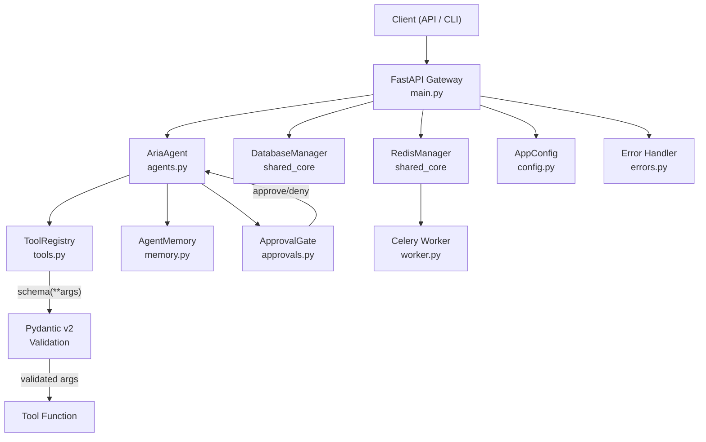

# Aria Agent

> **ARIA** — Agentic Reasoning & Integration Architecture


## A lightweight framework for controlled AI agents with tool registration, Pydantic-validated schemas, human approval gates, conversation memory, and execution tracing.

---

## Why This Exists

Most agent frameworks (LangChain, CrewAI, AutoGen) optimize for flexibility and chaining at the cost of control. When an LLM agent can call arbitrary tools with arbitrary parameters, the system's blast radius becomes difficult to reason about. A production agent needs:

- **Schema-enforced tool calls** — every tool invocation validated before execution, not after.
- **Human-in-the-loop gates** — critical actions require explicit approval, not silent auto-execution.
- **Bounded memory** — conversation context that doesn't silently grow unbounded until the token limit explodes.
- **Audit trails** — every tool call, approval decision, and agent turn recorded for post-hoc analysis.

Aria Agent is a minimal, opinionated agent framework that prioritizes safety boundaries and observability over feature count. It's designed to show how a real agent system enforces constraints — the kind of engineering that production AI systems need but demo frameworks skip.

> **Naming note** — This framework is **not related to [NousResearch/hermes-agent](https://github.com/NousResearch/hermes-agent)**. The original package was named `hermes`; it has been renamed to `aria_agent` (and the class to `AriaAgent`) to avoid confusion with the upstream fork in this same GitHub account. The two projects share a name in their heritage but are otherwise independent.

## What It Demonstrates

- **Agent loop architecture** — reason-and-act loop with `AriaAgent.run()` orchestrating tool selection, approval checks, and memory updates in a single pass
- **Tool registry with Pydantic validation** — `ToolRegistry` uses decorator-based registration with `type[BaseModel]` schemas; `call_tool()` validates arguments via `schema(**args).model_dump()` before execution
- **Human approval gates** — `ApprovalGate.request_approval()` intercepts tool calls with configurable enable/disable, logging parameters for audit before granting execution
- **Conversation memory** — `AgentMemory` tracks role-tagged messages (`user`, `system`) providing sliding-window context for multi-turn interactions
- **Structured error handling** — `BaseApplicationError` hierarchy from shared-core with global FastAPI exception handler returning typed JSON errors
- **Background task infrastructure** — Celery worker with Redis broker for async tool execution and long-running agent tasks
- **Health observability** — `/health` endpoint probing both PostgreSQL and Redis with graceful degradation reporting

## Architecture



### Request Flow

1. Client sends a message to `POST /agent/chat`
2. `AriaAgent.run()` receives the user query and writes it to `AgentMemory`
3. Agent determines which tool to invoke (currently keyword-based; LLM-based routing planned)
4. `ApprovalGate.request_approval()` checks whether the action requires human sign-off
5. If approved, `ToolRegistry.call_tool()` validates parameters against the tool's Pydantic schema
6. Tool executes and its output is stored in memory as a `system` message
7. Agent returns the formatted response to the client

## Tech Stack

| Component | Technology | Justification |
|-----------|-----------|---------------|
| **API Framework** | FastAPI 0.100+ | Async-native, auto-generated OpenAPI docs, Pydantic integration |
| **Validation** | Pydantic v2 | Tool argument schemas — validates before execution, not after |
| **Task Queue** | Celery 5.3+ / Redis 7 | Async tool execution for long-running operations |
| **Database** | PostgreSQL 16 (pgvector) | Agent run persistence, trace storage, future vector memory |
| **Logging** | Loguru via shared-core | Structured logging with service name tags |
| **Config** | pydantic-settings | Type-safe env var loading via `BaseAppConfig` |
| **HTTP Client** | httpx 0.24+ | Async HTTP for external tool calls (web search, APIs) |
| **Shared Library** | [shared-core](../shared-core/) | Config, database, redis, logging, errors — common across all showcase projects |

## Local Setup

```bash
# Enter the project directory
cd aria-agent

# Copy the environment template
cp .env.example .env

# Start PostgreSQL and Redis containers
make docker-up

# Install shared-core and project dependencies
make install

# Run the API server
make dev

# In another terminal — run the demo
make demo
```

### Prerequisites

- Python 3.10+
- Docker and Docker Compose (for PostgreSQL and Redis)
- `shared-core` cloned alongside this repo (sibling directory)

## Demo

```bash
make demo
```

Runs `examples/run_demo.py`, which:

1. Creates a `ToolRegistry` and registers a `calculator` tool with a `CalculatorSchema` (Pydantic model with an `expression: str` field)
2. Instantiates an `ApprovalGate` with approval enabled
3. Creates a `AriaAgent` wired to the registry and gate
4. Sends the query `"Please calculate 120 + 350"` through `agent.run()`
5. The approval gate logs a `SECURITY CHECK REQUIRED` warning, then auto-approves
6. The calculator tool validates and evaluates the expression
7. Prints the agent's final output: `"I calculated the value to be 470."`

**Expected output:**

```
--- Running Aria Agent Flow Demo ---
Agent Final Output: I calculated the value to be 470.
```

## Tests

```bash
make test
```

Current test coverage (`tests/test_core.py`):

- **Health endpoint** — verifies `GET /health` returns 200 with `service: "aria-agent"` and a `dependencies` object containing database and redis status

Planned test additions:

- Tool registration and schema validation (valid/invalid args)
- Approval gate enable/disable behavior
- Agent memory accumulation across turns
- Tool-not-found error handling
- Full agent run integration tests

## API Reference

### `POST /agent/chat`

Send a message to the agent for processing.

| Parameter | Type | Description |
|-----------|------|-------------|
| `message` | `str` (query) | The user's natural language input |

**Response:**
```json
{
  "reply": "I calculated the value to be 470."
}
```

### `GET /health`

Check service health with dependency status.

**Response:**
```json
{
  "status": "healthy",
  "service": "aria-agent",
  "dependencies": {
    "database": "online",
    "redis": "online"
  }
}
```

## Configuration

Key environment variables from `.env.example`:

| Variable | Default | Purpose |
|----------|---------|---------|
| `APP_NAME` | `aria-agent` | Service identifier in logs and health checks |
| `ENV` | `development` | Environment name (development/staging/production) |
| `DEBUG` | `true` | Enable debug mode |
| `LOG_LEVEL` | `INFO` | Loguru log level |
| `DATABASE_URL` | `postgresql+psycopg://...` | PostgreSQL connection string |
| `REDIS_URL` | `redis://localhost:6379/0` | Redis connection (broker + cache) |
| `OPENAI_API_KEY` | — | For LLM-backed agent routing (planned) |
| `ANTHROPIC_API_KEY` | — | Alternative LLM provider (planned) |

## Known Limitations

- **Keyword-based routing** — `AriaAgent.run()` currently uses `if "calculate" in user_query.lower()` to select tools, not LLM-based reasoning. This is intentional for the MVP skeleton to demonstrate the framework mechanics without requiring API keys.
- **Auto-approve only** — `ApprovalGate` logs a security warning but always returns `True`. Real approval queue (async with timeout) is planned for the display-ready milestone.
- **In-memory state only** — `AgentMemory` uses a Python list; no persistence across restarts. PostgreSQL-backed memory is on the roadmap.
- **Single tool registered** — only `calculator` exists in the demo. Five example tools (web_search_mock, calculator, file_reader, task_creator, email_draft_mock) are planned.
- **No cost tracking** — cost hooks for LLM token usage are designed but not yet implemented.
- **No trace logging** — per-run trace records (tool calls, durations, approval decisions) are planned but not yet wired.
- **`eval()` in calculator** — the demo calculator uses `eval()` with restricted builtins. This is a known unsafe pattern acceptable only for demonstration; production tools must never evaluate arbitrary expressions.

## Roadmap

- [x] **Phase 0** — Project skeleton, shared-core integration, FastAPI + health endpoint
- [ ] **Phase 1** — Full tool registry with 5 example tools, Pydantic schema validation, retry policies
- [ ] **Phase 2** — Async approval queue, agent memory persistence, cost tracking hooks
- [ ] **Phase 3** — Per-run trace logging, CLI inspector, dashboard for run history
- [ ] **Phase 4** — LLM-backed routing, prompt injection detection, tool permission levels

See [docs/roadmap.md](docs/roadmap.md) for detailed milestone breakdowns.

## Related Projects

Aria Agent is part of a [multi-project AI infrastructure portfolio](../). It integrates with:

- **[async-workflow-engine](../async-workflow-engine/)** — orchestrates multi-step agent workflows as DAGs
- **[llm-cost-latency-monitor](../llm-cost-latency-monitor/)** — tracks token costs and latency from agent LLM calls
- **[github-issue-pr-agent](../github-issue-pr-agent/)** — downstream consumer that uses Aria agents to analyze GitHub issues and generate PRs

## License

MIT
