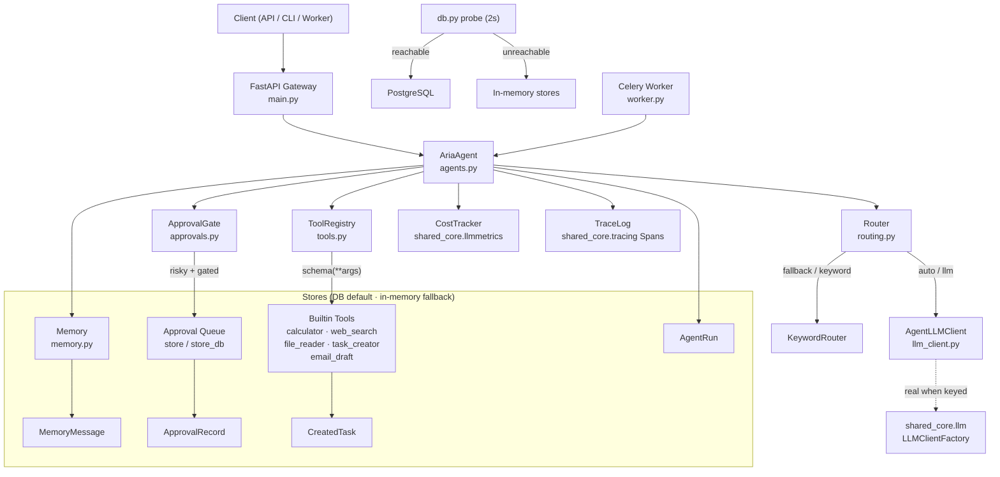

# ARIA Agent Framework

> A controlled AI agent framework: schema-validated tools with permission levels, LLM/keyword routing, a human-in-the-loop approval queue, persistent memory, cost tracking, and AgentTrace-compatible execution tracing.


ARIA runs **fully offline by default** — no database, no Redis, no API keys — using deterministic simulation. When you supply a database it persists state; when you supply OpenAI/Anthropic keys it routes with a real LLM. Nothing about the demo or the test suite requires the network.

---

## Why This Exists

Most agent frameworks optimize for flexibility and chaining at the cost of *control*. When an LLM agent can call arbitrary tools with arbitrary parameters, the system's blast radius becomes impossible to reason about. A production agent needs guardrails that demo frameworks skip:

- **Schema-enforced tool calls** — every tool invocation validated against a Pydantic schema *before* execution, not after.
- **Permission levels** — tools are classified `safe` vs `requires_approval`; risky actions can't silently auto-execute.
- **A real approval queue** — risky tool calls become *pending approvals* that a human approves or rejects, with a timeout, persisted so they survive a restart.
- **Bounded, persistent memory** — conversation context that survives restarts and never grows unbounded.
- **Cost and trace observability** — every run emits an AgentTrace-compatible span tree and a token/cost summary.
- **Progressive-disclosure skills** — `aria.skills` discovers bounded metadata
  from trusted project, user, and built-in scopes; full instructions load only
  through explicit activation, with per-turn deduplication and context evidence.

ARIA is a minimal, opinionated framework that prioritizes **safety boundaries and observability** over feature count.

## What It Demonstrates

- **Reason / route / approve / act loop** — `AriaAgent.run_structured()` routes a query to a tool, checks its permission against the approval gate, validates arguments, executes, traces, and records cost — in one auditable pass.
- **Dual routing** — a deterministic `KeywordRouter` and an `LLMRouter` that follows the offline-first / real-when-keyed pattern (a `mocked_response` short-circuit, else `shared_core.llm.LLMClientFactory`, with graceful fallback to keyword routing on no-key / ImportError / failure).
- **Tool permission levels** — `safe` tools run directly; `requires_approval` tools (task creation, email drafting) are gated.
- **Real approval queue** — pending → approved/rejected/expired lifecycle with a configurable timeout, in DB or in-memory, exposed over the API.
- **Free-running vs approval-gated modes** — selectable per request.
- **Four+ real tools** — AST-safe calculator, sandboxed file reader, real-or-mock web search, persisting task creator, structured (never-sent) email drafter.
- **Persistent state** — runs, tasks, approvals, and memory persist to PostgreSQL via SQLAlchemy + Alembic, with a transparent in-memory fallback selected by a startup DB probe.
- **Cost tracking** via `shared_core.pricing` + `shared_core.llmmetrics`; **tracing** via `shared_core.tracing` (one span per run + per tool call).

## Architecture


```mermaid
graph TD
    Client["Client (API / CLI / Worker)"] --> API["FastAPI Gateway<br/>main.py"]
    API --> Agent["AriaAgent<br/>agents.py"]

    Agent --> Router["Router<br/>routing.py"]
    Router -->|"auto / llm"| LLM["AgentLLMClient<br/>llm_client.py"]
    Router -->|"fallback / keyword"| KW["KeywordRouter"]
    LLM -.->|"real when keyed"| Factory["shared_core.llm<br/>LLMClientFactory"]

    Agent --> Gate["ApprovalGate<br/>approvals.py"]
    Gate -->|"risky + gated"| AQ["Approval Queue<br/>store / store_db"]

    Agent --> Registry["ToolRegistry<br/>tools.py"]
    Registry -->|"schema(**args)"| Tools["Builtin Tools<br/>calculator · web_search<br/>file_reader · task_creator<br/>email_draft"]

    Agent --> Memory["Memory<br/>memory.py"]
    Agent --> Cost["CostTracker<br/>shared_core.llmmetrics"]
    Agent --> Trace["TraceLog<br/>shared_core.tracing Spans"]

    subgraph Persistence["Stores (DB default · in-memory fallback)"]
        Runs["AgentRun"]
        Memory --> MsgDB["MemoryMessage"]
        AQ --> ApDB["ApprovalRecord"]
        Tools --> TaskDB["CreatedTask"]
    end
    Agent --> Runs

    Probe["db.py probe (2s)"] -->|"reachable"| PG["PostgreSQL"]
    Probe -->|"unreachable"| Mem["In-memory stores"]
    Worker["Celery Worker<br/>worker.py"] --> Agent
```

### Request flow (`POST /agent/chat`)

1. The query is written to memory (persistent or in-memory).
2. The router selects a tool (LLM routing with keyword fallback, or pure keyword) — recorded as a `decision` span.
3. The tool's permission level is checked against the approval gate. In `approval_gated` mode a `requires_approval` tool creates a **pending approval** and the run pauses, returning the approval id.
4. Otherwise the tool's arguments are validated against its Pydantic schema and the tool executes — recorded as a `tool` span with latency.
5. The result is stored in memory; the run (with full trace + cost) is persisted and returned.

## Tech Stack

| Component | Technology | Why |
|-----------|-----------|-----|
| **API** | FastAPI | Async, auto OpenAPI docs, Pydantic-native |
| **Validation** | Pydantic v2 | Tool argument schemas validated before execution |
| **Persistence** | SQLAlchemy 2.0 + Alembic / PostgreSQL 16 | Runs, tasks, approvals, memory — optional, with in-memory fallback |
| **Task queue** | Celery 5.3 / Redis 7 | Async agent runs + approval-timeout sweeps |
| **Routing / LLM** | `shared_core.llm` | Real OpenAI/Anthropic when keyed; deterministic sim otherwise |
| **Cost** | `shared_core.pricing` + `shared_core.llmmetrics` | Single source of truth for token pricing + percentiles |
| **Tracing** | `shared_core.tracing` | Canonical `Span`/`SpanType` (AgentTrace-compatible) |
| **Shared library** | [shared-core](../shared-core/) | config, database, redis, errors, logging, health, testing |

## Local Setup

```bash
cd aria-agent-framework

# (optional) copy env template — defaults already run offline
cp .env.example .env

# create a venv and install shared-core + this project
python -m venv .venv && . .venv/Scripts/activate   # Windows: .venv\Scripts\activate
pip install -e "../shared-core[dev,docparse]" numpy
pip install -e ".[dev]"

# run the demo (no DB, no keys, no network)
python examples/run_demo.py

# run the API
uvicorn aria.main:app --reload --app-dir src
```

To enable persistence: `make docker-up` (PostgreSQL + Redis), then `make migrate`. The service auto-detects the database on startup.

### Prerequisites

- Python 3.10+
- `shared-core` available as a sibling directory
- Docker + Compose **only** if you want persistence / the async worker

## Demo

```bash
make demo   # or: python examples/run_demo.py
```

The demo exercises the full framework offline: keyword + simulated-LLM routing, every builtin tool, free-running vs approval-gated modes, the approval queue (pending → approve → execute and the reject path), cost tracking, and span emission. It asserts behaviour and exits non-zero on any regression.

Three focused example agents are also included:

| Example | Demonstrates |
|---------|--------------|
| `examples/research_agent.py` | Safe, free-running, read-only tools (search/read/calc) |
| `examples/task_agent.py` | Persisting tasks in free-running mode |
| `examples/approval_gated_agent.py` | Risky tools pausing for approval; approve + reject paths |

## Tests

```bash
make test   # pytest -q
```

The skill layer has a focused offline verification path that does not import
the repository-wide `shared_core` fixtures and requires no API keys or network:

```bash
python -m pytest --noconftest tests/test_skills.py -q
```

Use `SkillRegistry.discover(...)` for metadata discovery and
`registry.create_session(...)` for explicit activation. Project-scope skills
are ignored unless `trust_project=True`; user and built-in scope roots are
supplied explicitly by the embedding application. Passing the resulting
session as `AriaAgent(..., skill_session=session)` adds skill context reporting
without replacing the existing tool registry or approval gate.

The repository-wide suite is designed to run offline (no network, DB, or keys)
using `shared_core.testing` mocks. It requires the sibling `shared_core` package
to be installed; the focused command above does not.

- **Unit** — every core module: tools (incl. AST-calculator golden cases + sandbox-traversal safety), routing (golden keyword + sim-LLM decisions), memory (in-memory + persistent), approvals (lifecycle on both backends), costs/tracing (golden cost equals `shared_core.pricing`).
- **Integration** — the agent loop end-to-end across both routers and both modes.
- **API** — every endpoint, success + error (404/409) paths.
- **Worker** — Celery app importable with no broker; real task bodies run eagerly.
- **Stores** — in-memory + SQLite-backed roundtrips and the DB-availability probe/fallback.

## API Reference

| Method & path | Purpose |
|---------------|---------|
| `POST /agent/chat` | Run the agent on a message (`{message, session_id?, mode?}`); returns reply, status, route, trace, cost, and any pending approval |
| `GET /agent/runs` | List recent runs (`?limit=`) |
| `GET /agent/runs/{id}` | Fetch a run with full trace + cost |
| `GET /agent/trace/{id}` | Fetch just the trace + cost for a run |
| `GET /approvals` | List approvals (`?status=pending|approved|rejected|expired`) |
| `GET /approvals/{id}` | Fetch a single approval |
| `POST /approvals/{id}/approve` | Approve a pending approval and execute the gated tool |
| `POST /approvals/{id}/reject` | Reject a pending approval |
| `GET /tools` / `GET /tools/{name}` | Tool registry introspection (incl. permission level + schema) |
| `GET /health` | Dependency health (DB + Redis) |

Everything a dashboard would need is exposed via this API (no frontend is included by design).

## Known Limitations

- **Single-step loop** — the agent routes to one tool per run rather than chaining many tool calls. The loop scaffolding (`max_steps`) is present; multi-hop planning is on the roadmap.
- **Simulated routing by default** — without API keys the LLM router returns a deterministic decision derived from the keyword router. This is intentional for offline reproducibility; real routing activates when keys are set.
- **Approval timeout is lazy** — pending approvals transition to `expired` when next read (or swept by the worker task), not via a background timer.
- **No auth** — the API has no authentication; it's a showcase, not a deployment.
- **Web search mock is small** — the offline knowledge base is a handful of canned entries; a real endpoint (`ARIA_SEARCH_API_URL`) replaces it.

## Roadmap

- [x] **Phase 1** — Tool registry with permission levels, 5 builtin tools, Pydantic validation
- [x] **Phase 2** — LLM/keyword routing, real approval queue, persistent memory, cost + trace
- [x] **Phase 3** — Full REST surface, persistent stores with in-memory fallback, Celery worker, Alembic
- [ ] **Phase 4** — Multi-hop planning loop, prompt-injection classifier on tool arguments, per-tool rate limits
- [ ] **Phase 5** — Streaming responses, approval webhooks, run replay from persisted traces

See [docs/roadmap.md](docs/roadmap.md) for the detailed breakdown and [docs/EXECUTION_PLAN.md](docs/EXECUTION_PLAN.md) for what was built.

## Related Projects

Part of a multi-project AI infrastructure portfolio built on [shared-core](../shared-core/):

- **[llm-cost-latency-monitor](../llm-cost-latency-monitor/)** — the cost/trace primitives ARIA reuses
- **[github-issue-pr-agent](../github-issue-pr-agent/)** — a downstream consumer of agent runs

## License

MIT
