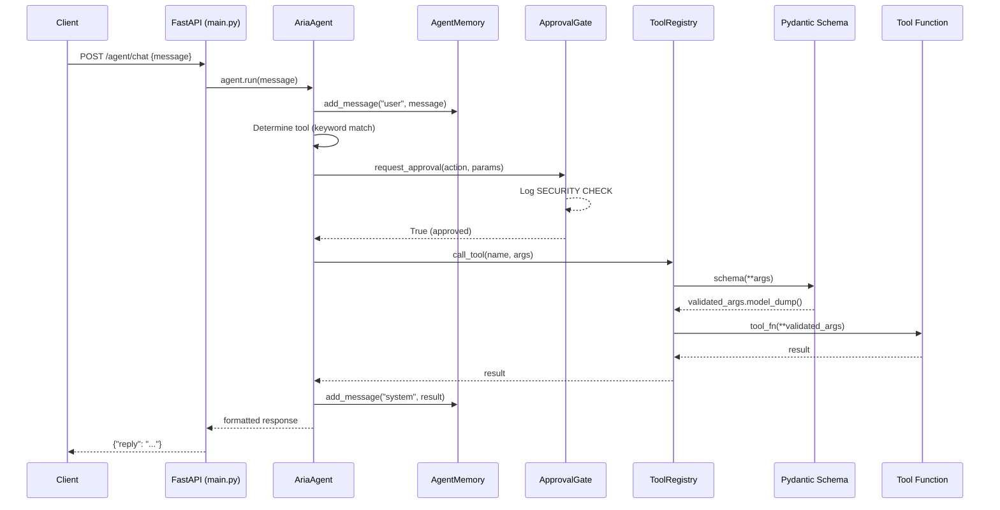
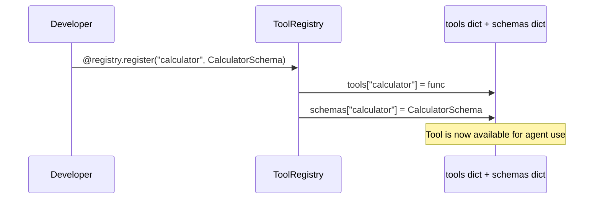
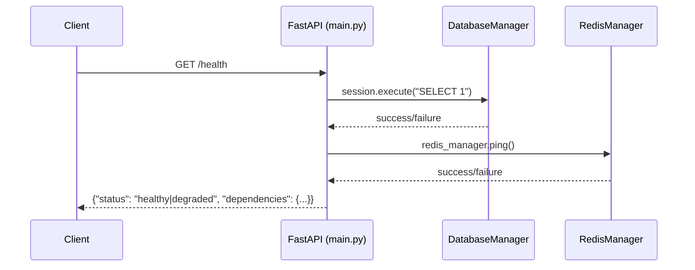
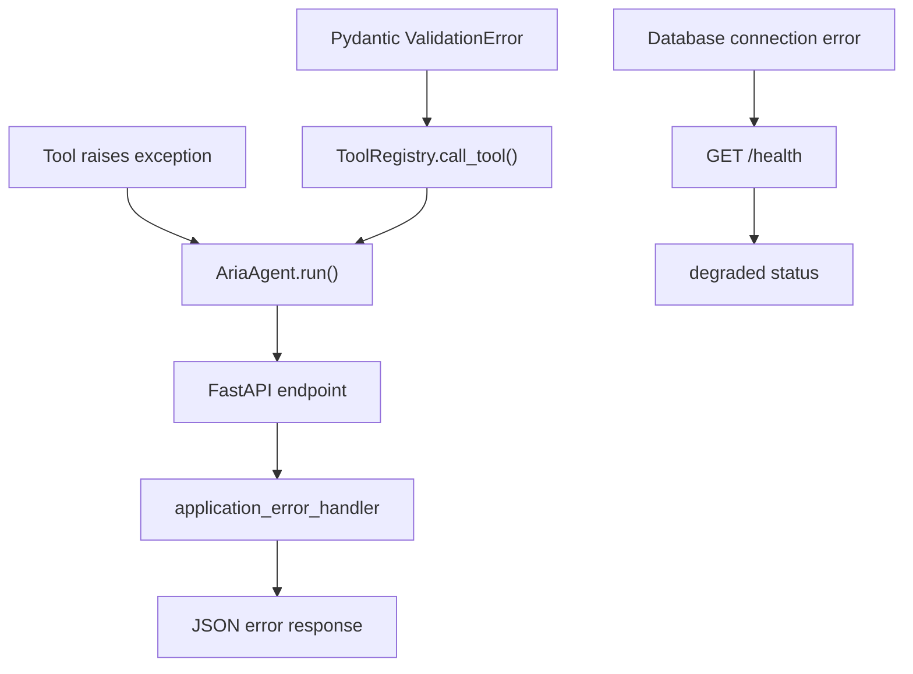

# Architecture Overview

This document describes the architectural layout, component interactions, and data flow of the Aria Agent (ARIA — Agentic Reasoning & Integration Architecture) — a controlled AI agent system with validated tool execution, human approval gates, and conversation memory.

## System Overview

Aria Agent is a FastAPI-based agent framework where a central `AriaAgent` orchestrates a reason-and-act loop. When a user sends a message to `POST /agent/chat`, the agent determines which tool to invoke, passes the call through an `ApprovalGate` for human review, validates parameters against a Pydantic schema via the `ToolRegistry`, executes the tool, stores the result in `AgentMemory`, and returns a formatted response.

The system is designed around three safety principles:
1. **No tool executes without schema validation** — `ToolRegistry.call_tool()` instantiates the tool's Pydantic model with the provided arguments before calling the function
2. **No critical action executes without approval** — `ApprovalGate.request_approval()` intercepts every tool call
3. **Every interaction is recorded** — `AgentMemory.add_message()` logs both user inputs and tool outputs

## Component Map

| Module | File | Responsibility |
|--------|------|----------------|
| **API Gateway** | `src/aria_agent/main.py` | FastAPI app, endpoint routing, dependency wiring, health checks |
| **Agent Core** | `src/aria_agent/agents.py` | `AriaAgent` — run loop, tool selection, orchestration |
| **Tool Registry** | `src/aria_agent/tools.py` | `ToolRegistry` — decorator-based registration, schema storage, validated execution |
| **Memory Store** | `src/aria_agent/memory.py` | `AgentMemory` — in-memory message history with role tagging |
| **Approval Gate** | `src/aria_agent/approvals.py` | `ApprovalGate` — human-in-the-loop checkpoint for tool calls |
| **Configuration** | `src/aria_agent/config.py` | `AppConfig` — pydantic-settings config extending `BaseAppConfig` |
| **Error Handling** | `src/aria_agent/errors.py` | `application_error_handler` — global FastAPI exception handler |
| **Background Worker** | `src/aria_agent/worker.py` | Celery app with Redis broker for async task execution |

### Shared-Core Dependencies

Aria depends on [`shared-core`](../../shared-core/) for cross-cutting concerns:

| shared-core Module | Usage in Aria |
|---------------------|-----------------|
| `shared_core.config.BaseAppConfig` | Base class for `AppConfig` — provides `DATABASE_URL`, `REDIS_URL`, `LOG_LEVEL` |
| `shared_core.database.DatabaseManager` | PostgreSQL session management for health checks and future persistence |
| `shared_core.redis.RedisManager` | Redis connection for health checks and Celery broker |
| `shared_core.logging.setup_logging` | Loguru configuration with service name tagging |
| `shared_core.errors.BaseApplicationError` | Base exception class for structured JSON error responses |

## Data Flow

### Agent Chat Flow



### Tool Registration Flow



### Health Check Flow



## Storage Model

### Current State (In-Memory)

`AgentMemory` stores messages as a Python list of dicts:

```python
# memory.messages structure
[
    {"role": "user", "content": "Please calculate 120 + 350"},
    {"role": "system", "content": "Tool output: 470"},
]
```

No persistence across process restarts. Memory is per-agent-instance.

### Planned Schema (PostgreSQL)

Future persistence will use the following tables:

| Table | Columns | Purpose |
|-------|---------|---------|
| `agent_sessions` | `id`, `agent_id`, `created_at`, `status` | Track agent conversation sessions |
| `agent_messages` | `id`, `session_id`, `role`, `content`, `created_at` | Persistent message history |
| `tool_calls` | `id`, `session_id`, `tool_name`, `args`, `result`, `duration_ms`, `approved_by` | Tool execution audit log |
| `agent_traces` | `id`, `session_id`, `event_type`, `payload`, `timestamp` | Per-run trace events |
| `cost_records` | `id`, `session_id`, `model`, `input_tokens`, `output_tokens`, `cost_usd` | LLM cost tracking |

## Background Jobs

### Celery Worker (`worker.py`)

The Celery app is configured with:
- **Broker**: Redis (from `REDIS_URL`)
- **Backend**: Redis (same URL)
- **Serialization**: JSON only (`task_serializer`, `accept_content`, `result_serializer`)
- **Timezone**: UTC

Currently contains only `sample_background_task(x, y)` as a stub. Planned tasks:

| Task | Purpose |
|------|---------|
| `execute_tool_async` | Run long-running tools (web search, file processing) without blocking the API |
| `process_approval_queue` | Poll approval requests and route to human reviewers |
| `persist_trace` | Write trace records to PostgreSQL asynchronously |
| `calculate_run_cost` | Aggregate LLM token usage and compute cost per agent run |

## External Dependencies

| Service | Required? | Purpose |
|---------|-----------|---------|
| PostgreSQL 16 | Yes | Health checks, future persistence (sessions, traces, costs) |
| Redis 7 | Yes | Health checks, Celery broker, future approval queue |
| OpenAI API | Planned | LLM-backed tool routing (replaces keyword matching) |
| Anthropic API | Planned | Alternative LLM provider |

## Failure Handling

### Current Implementation

- **Tool not found**: `ToolRegistry.call_tool()` raises `KeyError` if the tool name isn't registered — propagates as a 500 to the client
- **Schema validation failure**: Pydantic raises `ValidationError` if tool arguments don't match the schema — propagates as a 500
- **Database/Redis offline**: Health endpoint catches exceptions and reports `"degraded"` status with per-dependency breakdown
- **Application errors**: `application_error_handler` catches `BaseApplicationError` subclasses and returns structured JSON with status code, error code, and message

### Error Propagation Path



### Planned Improvements

- Retry policies with configurable max attempts and backoff
- Circuit breaker pattern for external tool calls
- Timeout enforcement on tool execution
- Dead-letter queue for permanently failed tool calls

## Security Boundaries

See [security.md](security.md) for the full security model. Key boundaries:

1. **Tool execution boundary** — all tool calls pass through `ToolRegistry.call_tool()` which validates arguments via Pydantic before execution
2. **Approval boundary** — `ApprovalGate.request_approval()` sits between tool selection and tool execution; can block dangerous actions
3. **API boundary** — FastAPI with `BaseApplicationError` handler ensures no raw tracebacks leak to clients
4. **Configuration boundary** — secrets loaded from environment variables via pydantic-settings, never hardcoded
